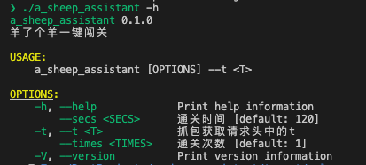

# A sheep assistant

羊了个羊助手

## 安装

1. 从[Releases](https://github.com/ClassmateLin/a_sheep_assistant/releases)中下载二进制包。

2. 自行编译:

```
$ git clone https://github.com/ClassmateLin/a_sheep_assistant/ && cd a_sheep_assistant/
$ cargo build --releases
```
执行完命令, 可在`./target/release`找到二进制文件`a_sheep_assistant`。

## 使用


```
// 默认120秒通过1次。t是请求头中的数据, 需要抓包获取。
$ ./a_sheep_assistant -t eyJhbGciOiJIUzI1NiIsInR5cCI6xXXXXXXXXXXXXXXXXXXXXXXX
恭喜成功完成闯关...
```

``` 
// 60秒通过, 仅一次
$ ./a_sheep_assistant -t eyJhbGciOiJIUzI1NiIsInR5cCI6xXXXXXXXXXXXXXXXXXXXXXXX -secs 60
```

``` 
// 60秒通过, 总共通过10次
$ ./a_sheep_assistant -t eyJhbGciOiJIUzI1NiIsInR5cCI6xXXXXXXXXXXXXXXXXXXXXXXX --secs 60 --times 10
```

## 免责声明
本仓库发布的 a_sheep_assistant(下文均用本项目代替) 项目中涉及的任何脚本，仅用于测试和学习研究，禁止用于商业用途，不能保证其合法性，准确性，完整性和有效性，请根据情况自行判断。

本项目内所有资源文件，禁止任何公众号、自媒体进行任何形式的转载、发布，禁止直接改项目名二次发布。

作者对任何脚本问题概不负责，包括但不限于由任何脚本错误导致的任何损失或损害.

请勿将本项目的任何内容用于商业或非法目的，否则后果自负。

如果任何单位或个人认为该项目的脚本可能涉嫌侵犯其权利，则应及时通知并提供身份证明，所有权证明，我们将在收到认证文件后删除相关脚本。

以任何方式查看此项目的人或直接或间接使用本项目的任何脚本的使用者都应仔细阅读此声明。

作者保留随时更改或补充此免责声明的权利。一旦使用并复制了任何相关脚本或本项目，则视为您已接受此免责声明。

您必须在下载后的24个小时之内，从您的电脑或手机中彻底删除上述内容。

本项目遵循GPL-3.0 License协议，如果本特别声明与GPL-3.0 License协议有冲突之处，以本特别声明为准。

**您使用或者复制了本仓库且本人制作的任何代码或项目，则视为已接受此声明，请仔细阅读。**